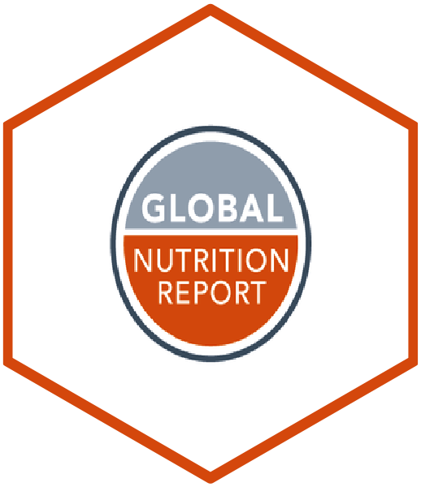

<!-- README.md is generated from README.Rmd. Please edit that file -->

# gnr: R Companion to the Global Nutrition Report 

<!-- badges: start -->

[](https://www.repostatus.org/#wip)
[](https://www.tidyverse.org/lifecycle/#experimental)
[](https://github.com/nutriverse/gnr/actions/workflows/R-CMD-check.yaml)
[](https://codecov.io/gh/nutriverse/gnr?branch=master)
[](https://www.codefactor.io/repository/github/nutriverse/gnr)
[](https://zenodo.org/badge/latestdoi/187449399)
<!-- badges: end -->

The Global Nutrition Report’s purpose is to produce a single,
authoritative source on progress toward addressing critical gaps in the
nutrition accountability framework, both at national and international
levels. This is a companion package to the Global Nutrition Report
primarily for accessing the data used in the report and to reproduce the
data visualisation produced in the report. This package contains
functions that allow users to interrogate the same data and produce
customised charts and other visualisation products.

## What does `gnr` do?

## Installation

The `{gnr}` package is not yet available on
[CRAN](https://cran.r-project.org) but can be installed from the
[nutriverse R Universe](https://nutriverse.r-universe.dev) as follows:

``` r
install.packages(
  "gnr", 
  repos = c("https://nutriverse.r-universe.dev", "https://cloud.r-project.org")
)
```

The current development version of `{gnr}` can also be installed from
[GitHub](https://github.com/nutriverse/gnr) using the `{pak}` package as
follows:

``` r
if (!require("pak")) install.packages("pak")
pak::pak("nutriverse/gnr")
```

## Usage

## Citation

If you use `{gnr}` in your work, please cite using the suggested
citation provided by a call to the `citation` function as follows:

``` r
citation("gnr")
#> To cite gnr in publications use:
#> 
#>   Ernest Guevarra (2025). _gnr: R companion to the Global Nutrition
#>   Report_. doi:10.5281/zenodo.187449399
#>   <https://doi.org/10.5281/zenodo.187449399>, R package version
#>   0.0.0.9000, <https://nutriverse.io/gnr/>.
#> 
#> A BibTeX entry for LaTeX users is
#> 
#>   @Manual{,
#>     title = {gnr: R companion to the Global Nutrition Report},
#>     author = {{Ernest Guevarra}},
#>     year = {2025},
#>     note = {R package version 0.0.0.9000},
#>     url = {https://nutriverse.io/gnr/},
#>     doi = {10.5281/zenodo.187449399},
#>   }
```

## Community guidelines

Feedback, bug reports, and feature requests are welcome; file issues or
seek support [here](https://github.com/nutriverse/gnr/issues). If you
would like to contribute to the package, please see our [contributing
guidelines](https://nutriverse.io/gnr/CONTRIBUTING.html).

This project is released with a [Contributor Code of
Conduct](https://nutriverse.io/gnr/CODE_OF_CONDUCT.html). By
contributing to this project, you agree to abide by its terms.
